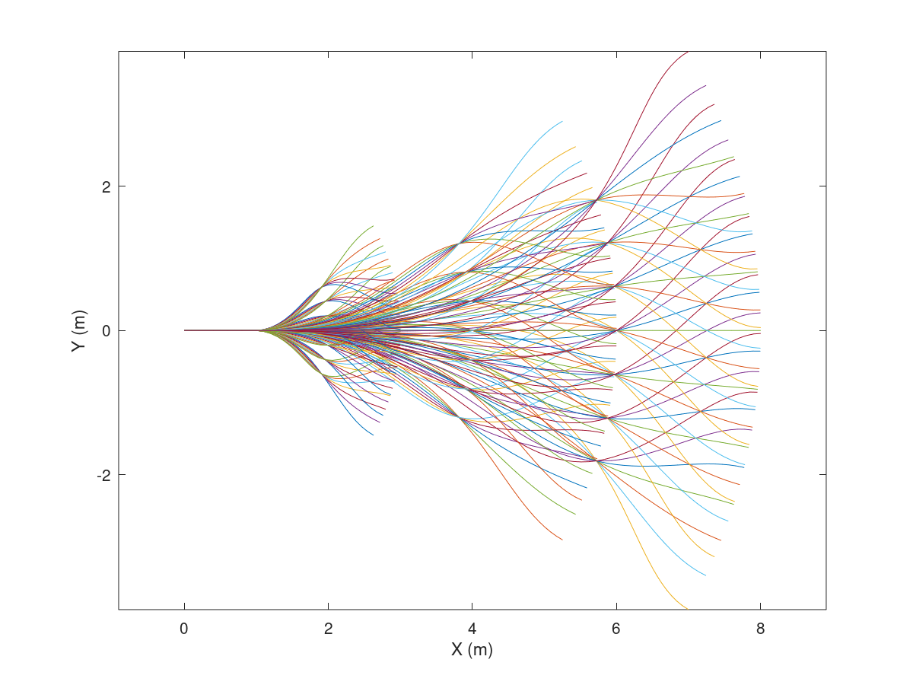
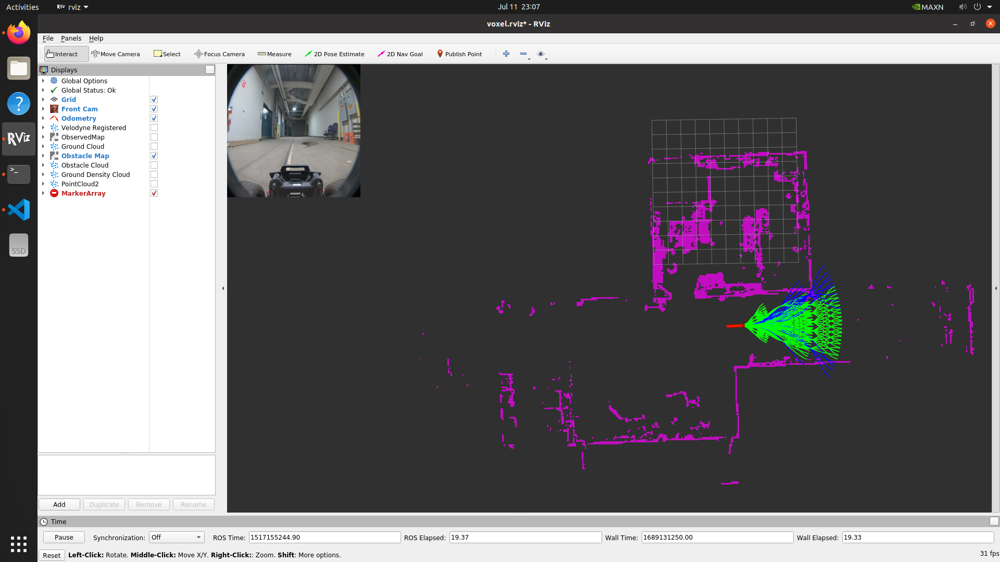

# TrajectoryLibrary

This is a very basic trajectory library that was developed to assist in the development/testing of other projects. The intention of the trajectory library was to create a very simple, deterministic planner to help evaluate/characterize a voxel grid pipeline from another repo (will add soon).

The trajectory library preloads .ply files which contain the list of potential trajectories. The trajectories are transformed from the sensor/vehicle frame to the sensor_init frame and evaluated against a costmap/occupancy grid that comes from the voxel grid perception after collapsing some of its 3D information into a 2D occupancy grid.

The trajectories can be arbitrarily designed. Right now, there are 3 main swaths, each at different distances to the vehicle (short, medium, and long range). 

An illustration of the raw trajectories can be seen below.

An illustration of the trajectory library running can be seen below.

## ToDo
* Create a real cost function to give more realistic costs to trajectories (e.g. consider waypoints, consider continuity of selected trajectories, etc)
* Create waypoint manager logic
* Create more dynamic trajectory library (e.g. scales with speed, handles backward/edge cases more explicitly, etc)
* Many more things (e.g. actually leverage 3d data from voxel grid, use gpu for parallel processing, other tasks as needed)

**Last update:** *2023/07/11*
**Created:** *2023/07/11*
**Author:** Ryan Darnley <rdarnley@andrew.cmu.edu>
